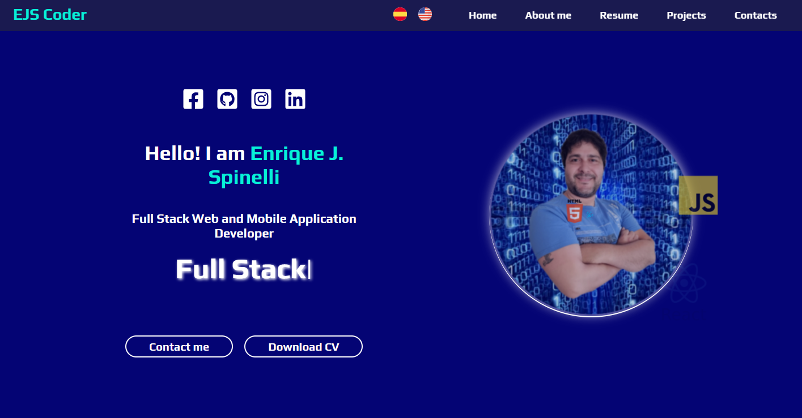

<h1>Hello, I´m Enrique Javier Spinelli (Frontend Developer)</h1>

 

 

<h2>Welcome to my personal portfolio</h2>

This is a dynamic portfolio showcase built with ReactJs and CSS. This project reflects my dedication to creating seamless and visually stunning web applications.

<h2>Key Features:</h2>
<h4>Responsive Design:</h4>

The portfolio is meticulously designed to be responsive across various devices, ensuring a flawless user experience whether accessed on a desktop, tablet, or smartphone.

<h4>Intuitive Navigation:</h4>

Experience a user-friendly interface with smooth navigation, allowing visitors to effortlessly explore my skills, projects, and accomplishments. The intuitive layout enhances the overall usability of the portfolio.

<h4>Animated Transitions:</h4>

Elevate the user experience with subtle yet impactful animated transitions. CSS animations have been employed to bring a touch of dynamism to the portfolio, making it engaging and visually appealing.

